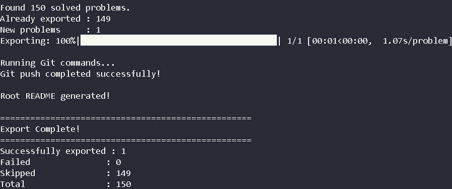

# LeetCode Exporter


A Python command-line tool that automatically exports your accepted LeetCode submissions into a clean, well-organized GitHub repository.

Instead of manually copying solutions after every accepted problem, **LeetCode Exporter** downloads your latest accepted submission, organizes it into numbered folders, generates documentation, updates the repository index, and can optionally commit and push everything to GitHub.

---

## Demo



---

## Why I Built This

After solving hundreds of LeetCode problems, maintaining a GitHub repository manually became repetitive.

Every accepted submission required creating folders, copying code, updating the repository README, committing changes, and pushing everything to GitHub.

This project automates that workflow while keeping the generated repository organized, consistent, and easy to navigate.

---

## Features

* Export accepted LeetCode submissions
* Skip already exported problems
* Force re-export existing solutions
* Export problems by difficulty
* Configurable output directory
* Generate a README for every exported problem
* Generate a root README with solution statistics
* Store metadata (`metadata.json`) for every solution
* Automatically commit and push changes using `--push`
* Modular architecture for easy extension

---

## Installation

Clone the repository

```bash
git clone https://github.com/thekeshavladdha/leetcode-exporter.git
cd leetcode-exporter
```

Install the required packages

```bash
pip install -r requirements.txt
```

---

## Configuration

Copy the example configuration.

**Windows**

```text
Copy config.example.py
Rename it to config.py
```

Edit `config.py` and fill in your credentials.

```python
LEETCODE_SESSION = "YOUR_LEETCODE_SESSION"

CSRFTOKEN = "YOUR_CSRF_TOKEN"

DEFAULT_OUTPUT_DIR = r"C:\Path\To\LeetCode-Solutions"
```

---

## Usage

Export only new solutions

```bash
python exporter.py
```

Re-export every solution

```bash
python exporter.py --force
```

Export only hard problems

```bash
python exporter.py --difficulty hard
```

Export to another directory

```bash
python exporter.py --output "D:\LeetCode-Solutions"
```

Automatically commit and push exported solutions

```bash
python exporter.py --push
```

---

## Example Output

```text
Found 150 solved problems.

Already exported : 149
New problems     : 1

Exporting: 100%

Running Git commands...
Git push completed successfully!

Root README generated!

==================================================
Export Complete!
==================================================
Successfully exported : 1
Failed               : 0
Skipped              : 149
Total                : 150
```

---

## Generated Repository Structure

```text
LeetCode-Solutions/
│
├── README.md
├── 0001-Two-Sum/
│   ├── solution.cpp
│   ├── README.md
│   └── metadata.json
├── 0002-Add-Two-Numbers/
│   ├── solution.cpp
│   ├── README.md
│   └── metadata.json
└── ...
```

---

## Project Structure

```text
leetcode-exporter/
│
├── api.py
├── cli.py
├── config.example.py
├── exporter.py
├── filesystem.py
├── git_utils.py
├── markdown.py
├── requirements.txt
├── assets/
│   └── demo.png
└── README.md
```

### Modules

| File            | Purpose                                             |
| --------------- | --------------------------------------------------- |
| `exporter.py`   | Main application entry point                        |
| `api.py`        | Handles communication with the LeetCode GraphQL API |
| `filesystem.py` | Saves solutions and metadata                        |
| `markdown.py`   | Generates README files                              |
| `git_utils.py`  | Handles Git commit and push operations              |
| `cli.py`        | Parses command-line arguments                       |

---

## Roadmap

* [ ] Export individual problems
* [ ] Export by programming language
* [ ] Publish to PyPI

---

## License

This project is licensed under the MIT License.
